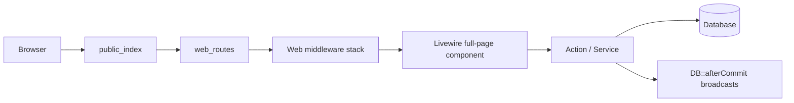

# karman.store — Project Structure

> Generated from workspace inspection (July 2026).  
> Product: **İndirimGo** — Laravel 12 e-commerce and wallet platform (storefront + operations backend).

---

## Overview

| Area | Purpose |
|------|---------|
| **Storefront** | Categories, packages, products, cart, buy-now, orders, **Financial Centre** (wallet/transactions/topups/refunds/earnings), loyalty, referrals, Activity |
| **Backend** | Fulfillments, topups, refunds, settlements, commissions, users, catalog admin, **credit facility**, **wallet adjustments**, **automation admin**, **Ops Assistant**, **price drift**, payment methods (website settings) |
| **Mobile API** | Customer Sanctum PAT `/api/v1` (auth + catalog read); Flutter app separate repo |
| **Financial core** | `wallets` + `wallet_transactions` as source of truth (`balance` may be negative under Active credit facility); `system_events` for audit |
| **Fulfillment automation** | Browser-driven supplier fulfillment via Node/Playwright worker + Laravel run orchestration |
| **Supplier price scans** | Wasim catalog price comparison (`/price-drift`) + reactive flags from fulfillments |
| **Realtime** | Laravel Reverb + Echo; Firebase FCM for push |

**Locales:** English (`en`) and Arabic (`ar`) — RTL-aware UI.

---

## Laravel 12 Application Skeleton

This project uses Laravel 11+ streamlined layout (no `app/Http/Kernel.php`, no `app/Console/Kernel.php`).

| Path | Role |
|------|------|
| `bootstrap/app.php` | Application factory: routes, middleware aliases, exceptions |
| `bootstrap/providers.php` | Service providers (`AppServiceProvider`, `FortifyServiceProvider`, optional Telescope) |
| `routes/web.php` | Primary HTTP + Livewire full-page routes |
| `routes/api.php` | Mobile `/api/v1` Sanctum PAT endpoints |
| `routes/automation.php` | Worker callbacks + admin artifact routes (loaded from `bootstrap/app.php` `then`) |
| `routes/ai.php` | Ops Assistant MCP endpoint (`POST /mcp/ops-assistant`) |
| `routes/settings.php` | Fortify-adjacent user settings (profile, password, 2FA, appearance) |
| `routes/channels.php` | Private broadcast channel auth |
| `routes/console.php` | Artisan schedule / closure commands |
| `public/index.php` | Front controller |

**Registered middleware** (`bootstrap/app.php`):

- Web stack append: `SetLocale`, `CaptureReferralFromQuery`, `EnsureAccountCanUseSession`
- CSRF exempt: `internal/automation/*` (HMAC-verified worker callbacks)
- Aliases: `admin`, `backend`, `automation.signature`, Spatie `role`, `permission`, `role_or_permission`

**Providers** (`bootstrap/providers.php`): app bindings, Fortify views/responses, Telescope when installed.

---

## Code Organization Conventions

### Actions (application layer)

Domain mutations live in `app/Actions/{Domain}/{Verb}{Noun}.php` as invokable or `handle()` classes — not fat controllers.

```text
CheckoutFromPayload      → cart → order (returns CheckoutResult)
PayOrderWithWallet       → WalletSpendPolicy gate + wallet debit + fulfillments
UpdateCreditFacility     → grant/update customer overdraft facility (no balance change)
ApproveTopupRequest      → credit wallet + system event (also repays debt by arithmetic)
CompleteFulfillment      → status transition + notifications
```

Controllers stay thin (file downloads, JSON quotes, push token registration). Prefer Actions + Services for business rules.

### Domain vs services

| Layer | Location | Example |
|-------|----------|---------|
| Pure pricing rules | `app/Domain/Pricing/` | `PricingEngine`, `CustomAmountValidator` |
| Registration security | `app/Domain/Security/` | Turnstile, honeypot, registration rate limits |
| Orchestration / IO | `app/Services/` | `PriceCalculator`, `FirebasePushService`, `SystemEventService`, `SupplierPriceScanService` |
| Persistence | `app/Models/` | Eloquent + relationships, casts in `casts()` where used |

### Livewire 4 full-page components

Pages are **single-file components** under `resources/views/pages/**/⚡*.blade.php`:

- PHP class + Blade markup in one file (anonymous `extends Component`)
- Registered as `Route::livewire('/path', 'pages::frontend.main')` (namespace → folder path)
- `#[Layout('layouts::frontend')]` or backend layout attribute on the class
- Reusable widgets remain class-based under `app/Livewire/` (sidebar badges, settings, PowerGrid tables)

### Authorization

- **Route level:** `middleware('can:…')`, `backend`, `admin`
- **Action level:** policies (`app/Policies/`) and `$this->authorize()` in Livewire
- **Permission source:** `config/permission.php` → `backend_permissions` + Spatie roles (`Docs/roles.md`)

---

## Request Flow (typical Livewire page)



1. `routes/web.php` resolves a `Route::livewire()` target.
2. Middleware enforces auth, verification, backend access, or gates.
3. Component methods validate input and call Actions.
4. Financial writes run in transactions; events/notifications fire after commit.

---

## Route Map

### Public storefront

| Path | Livewire / handler | Route name |
|------|-------------------|------------|
| `/` | `pages::frontend.main` | `home` |
| `/categories/{category:slug}` | `pages::frontend.category-show` | `categories.show` |
| `/contact` | `pages::frontend.contact` | `contact` |
| `/cart` | `pages::frontend.cart` | `cart` |
| `/api/storefront/packages/search` | `SearchPackagesController` | `api.storefront.packages.search` |
| `language/{locale}` | Closure (`en` / `ar`) | `language.switch` |

### Authenticated customer (`auth`, `verified`)

| Path | Component | Route name |
|------|-----------|------------|
| `/account` | `pages::frontend.account` | `account` |
| `/profile` | `pages::frontend.profile` | `profile` |
| `/profile/edit` | `pages::frontend.profile-edit` | `profile.edit-information` |
| `/wallet` | `pages::frontend.wallet` | `wallet` |
| `/wallet/transactions` | `pages::frontend.wallet-transactions` | `wallet.transactions.index` |
| `/wallet/transactions/{transaction}` | `pages::frontend.wallet-transaction-detail` | `wallet.transactions.show` |
| `/wallet/topups` | `pages::frontend.wallet-topups` | `wallet.topups.index` |
| `/wallet/topups/{topup}` | `pages::frontend.wallet-topup-detail` | `wallet.topups.show` |
| `/wallet/topup` | `pages::frontend.wallet-topup` | `wallet.topup` |
| `/wallet/refunds` | `pages::frontend.wallet-refunds` | `wallet.refunds.index` |
| `/wallet/refunds/{refund}` | `pages::frontend.wallet-refund-detail` | `wallet.refunds.show` |
| `/wallet/earnings` | `pages::frontend.wallet-earnings` | `wallet.earnings.index` (`can:view_referrals`) |
| `/loyalty` | `pages::frontend.loyalty` | `loyalty` |
| `/referral-link` | `pages::frontend.referral-link` | `referral-link` (`can:view_referrals`) |
| `/orders` | `pages::frontend.orders` | `orders.index` |
| `/orders/{order:order_number}` | `pages::frontend.order-details` | `orders.show` |
| `/activity` | `pages::frontend.activity` | `activity.index` |
| `/notifications` | `pages::frontend.activity` | `notifications.index` (alias → Activity) |
| `/topup-proofs/{proof}` | `TopupProofController@show` | `topup-proofs.show` |
| `/bug-attachments/{attachment}` | `BugAttachmentController@show` | `bug-attachments.show` |
| `POST /api/pricing/buy-now-custom-amount-quote` | `BuyNowCustomAmountQuoteController` | `api.pricing.buy-now-custom-amount-quote` |

### Settings (`routes/settings.php`)

| Path | Class | Route name |
|------|-------|------------|
| `/settings/profile` | `Settings\Profile` | `profile.edit` |
| `/settings/password` | `Settings\Password` | `user-password.edit` |
| `/settings/appearance` | `Settings\Appearance` | `appearance.edit` |
| `/settings/two-factor` | `Settings\TwoFactor` | `two-factor.show` |

### Backend (`auth`, `verified`, `backend`)

| Path | Component / class | Notes |
|------|-------------------|--------|
| `/dashboard` | `pages::backend.dashboard` | `can:view_dashboard` |
| `/salesperson-dashboard` | `pages::backend.salesperson-dashboard` | `can:view_referrals` |
| `/salesperson/users` | `pages::backend.salesperson-users.index` | `can:manage_referred_users` |
| `/categories`, `/packages`, `/products` | backend index pages | catalog admin |
| `/product-entry-prices` | entry prices | `can:update_product_prices` |
| `/price-drift` | Wasim supplier price drift monitor | `can:update_product_prices` |
| `/pricing-rules`, `/loyalty-tiers` | config pages | |
| `/admin/orders`, `/admin/orders/{order}` | orders admin | |
| `/fulfillments`, `/refunds`, `/topups` | operations | |
| `/customer-funds`, `/settlements` | finance | |
| `/wallet-adjustments` | admin credit/debit adjustments | `can:adjust_wallets` |
| `/credit-facility` | credit facility / overdraft ops | `can:manage_wallet_credit` |
| `/admin/commissions` | `CommissionsTable` | `can:manage_settlements` |
| `/admin/payout-requests` | `PayoutRequestsTable` | `can:manage_settlements` |
| `/admin/users`, `/admin/users/{user}`, `/admin/users/{user}/audit` | users | `can:manage_users` |
| `/admin/activities`, `/admin/system-events`, `/admin/notifications` | observability | |
| `POST api/admin/push/register-token` | `PushTokenController` | FCM registration |

### Admin-only

| Path | Component | Gate |
|------|-----------|------|
| `/admin/website-settings` | `pages::backend.website-settings.index` | `admin` middleware |
| `/admin/automation` | `App\Livewire\Admin\AutomationMonitor` | `admin` middleware — runs inbox (Reverb), needs-review, Wasim credentials, session clear |
| `/admin/assistant` | `App\Livewire\Admin\AssistantChat` | `admin` middleware + `throttle:20,1` — read-only Ops Assistant chat |
| `/admin/bugs`, `/admin/bugs/{bug}` | bug Livewire pages | `can:manage_bugs` |

**Sidebar (Operations group):** admins see **Automation** and **Ops Assistant** links in `resources/views/layouts/app/sidebar.blade.php`.

### Automation routes (`routes/automation.php`)

| Path | Handler | Notes |
|------|---------|--------|
| `POST /internal/automation/runs/{uuid}/result` | `FulfillmentAutomationCallbackController@result` | HMAC middleware |
| `POST /internal/automation/runs/{uuid}/artifacts` | `FulfillmentAutomationCallbackController@artifacts` | HMAC middleware |
| `POST /internal/automation/price-scans/{uuid}/result` | `SupplierPriceScanCallbackController@result` | HMAC middleware |
| `GET /admin/fulfillment-automation/runs/{run}/artifact` | `FulfillmentAutomationArtifactController@show` | Auth + backend; signed artifact access |

**Worker HTTP** (separate Node process, `automation-worker/`):

| Path | Notes |
|------|--------|
| `GET /health` | Build id, feature flags (`wasim_submit_purchase`, `wasim_reconcile`, `session_clear`) |
| `POST /v1/runs` | HMAC — execute automation driver |
| `POST /v1/price-scans` | HMAC — Wasim catalog price scan |
| `POST /v1/sessions/clear` | HMAC — clear Playwright session for a `session_key` (e.g. `wasim-main`) |

### AI routes (`routes/ai.php`)

| Path | Handler | Notes |
|------|---------|--------|
| `POST /mcp/ops-assistant` | `OpsAssistantServer` (Laravel MCP) | Admin-authenticated read-only order/wallet/fulfillment tools |

Fortify handles login, register, password reset, and email verification (configured in `config/fortify.php` + `FortifyServiceProvider`).

**Public registration guards** (self-register only; not admin/salesperson user creation): `RegisteredUserController` → `GuardRegistrationAttempt` — honeypot + rate limits (`config/security.php`) + Cloudflare Turnstile (`config/services.php` `turnstile`). Tests: `tests/Feature/Auth/RegistrationTest.php`.

### Mobile API (`routes/api.php`)

Customer-only Sanctum PAT API under `/api/v1` (no web-session fallback). Ability: `mobile:access`.

| Path | Handler | Notes |
|------|---------|--------|
| `POST /api/v1/auth/login` | `LoginController` | `throttle:mobile-login` |
| `POST /api/v1/auth/two-factor-challenge` | `TwoFactorChallengeController` | Fortify 2FA; `throttle:mobile-two-factor` |
| `POST /api/v1/auth/logout` | `LogoutController` | auth:sanctum + ability |
| `GET /api/v1/me` | `MeController` | auth:sanctum + ability |
| `GET /api/v1/catalog/home` | `CatalogHomeController` | `throttle:mobile-catalog` |
| `GET /api/v1/packages` | `PackageIndexController` | priced server-side |
| `GET /api/v1/packages/{package}` | `PackageShowController` | priced server-side |

Contract: `docs/api/v1/openapi.yaml`. Config: `config/mobile_api.php`.

---

## Database Seeders

| Seeder | Purpose |
|--------|---------|
| `RolesAndPermissionsSeeder` | Roles, permissions, backend permission grants |
| `CategorySeeder`, `PackageSeeder`, `ProductSeeder` | Catalog baseline |
| `PackageRequirementSeeder` | Requirement fields per package |
| `DefaultPricingRuleSeeder` | Default pricing rules |
| `LoyaltyTierConfigSeeder` | Loyalty tier configuration |
| `DatabaseSeeder` | Orchestrates the above |

Run: `php artisan db:seed`.

---

## Artisan Commands (`app/Console/Commands/`)

| Command | Purpose |
|---------|---------|
| `ProcessFulfillments` | Process pending fulfillment queue/workflow |
| `fulfillment:dispatch-automation` | Dispatch browser automation jobs for eligible queued fulfillments |
| `fulfillment:sweep-stale-automation-runs` | Mark stale active runs failed/cancelled |
| `wasim:sweep-stale-price-scans` | Fail stale supplier price scan runs |
| `WalletReconcile` | Reconcile wallet balances vs transactions |
| `ProfitSettleCommand` | Settlement / profit batch processing |
| `EvaluateLoyaltyCommand` | Loyalty tier evaluation |
| `PushHealthCheckCommand` / `PushCleanupCommand` | FCM push maintenance |

Scheduled tasks live in `routes/console.php` (automation dispatch/sweep gated on `config('fulfillment_automation.enabled')`).

---

## Top-Level Layout

```
karman.store/
├── app/                 # Application code (Actions, Models, Livewire, Services, …)
├── automation-worker/   # Node/Playwright fulfillment execution runtime (supplier drivers)
├── bootstrap/           # Laravel 12 app bootstrap (middleware, routing)
├── config/              # App, auth, permissions, fulfillment_automation, PWA, Reverb, …
├── database/
│   ├── factories/
│   ├── migrations/      # ~100 migration files
│   └── seeders/
├── Docs/                # Internal documentation (this file, DB, roles, playbooks)
├── lang/                # en/ar translations + vendor backup strings
├── public/              # Web root, PWA manifest, payment-method images, assets
├── resources/
│   ├── css/             # Tailwind v4 entry
│   ├── js/              # Vite bundle (Alpine, Echo, Firebase)
│   └── views/           # Blade, Flux, Livewire full-page components
├── routes/              # web.php, api.php, automation.php, settings.php, channels.php, console.php, ai.php
├── storage/             # Logs, framework cache, Livewire temp uploads, automation artifacts
├── tests/               # Pest feature + unit tests (~125 files)
├── .cursor/             # Agent rules (laravel-boost.mdc) and project skills
├── vendor/              # Composer dependencies
└── node_modules/        # Frontend dependencies
```

---

## Tech Stack

| Layer | Packages |
|-------|----------|
| Runtime | PHP 8.4, Laravel 12 |
| UI | Livewire 4, Flux (free only), **Tailwind CSS 4.1**, Alpine.js |
| Auth | Laravel Fortify (2FA, registration, password reset) + Turnstile/honeypot/rate limits on public register |
| Permissions | `spatie/laravel-permission` |
| Audit | `spatie/laravel-activitylog` |
| Tables (admin) | `power-components/livewire-powergrid` |
| Realtime | `laravel/reverb`, `laravel-echo`, `pusher-js` |
| AI | `laravel/ai` (Ops Assistant), `laravel/mcp` (`/mcp/ops-assistant`) |
| Push | Firebase (client + `FirebasePushService`) |
| PWA | `erag/laravel-pwa` |
| Testing | Pest 3, PHPUnit 11 |
| Dev | Laravel Telescope, Debugbar, Pint, Boost MCP |

**Agent conventions** (`.cursor/rules/laravel-boost.mdc`): PHP 8.4, Laravel 12, Livewire 4, Flux free, Tailwind 4.1; Actions-first mutations; Pest tests for changes; Pint before commit; financial guardrails in section below.

---

## Fulfillment automation (browser providers)

Laravel orchestrates; the worker only runs browsers and reports results.

### Purchase flow

```text
Paid order → CreateFulfillmentsForOrder (provider from package)
          → DispatchFulfillmentAutomationJob (if eligible)
          → ReserveFulfillmentAutomationRun
          → DispatchFulfillmentAutomationRun (POST /v1/runs to worker, HMAC)
          → Worker executes driver (wasim purchase phase, acme, …)
          → POST callback result/artifacts to Laravel
          → IngestFulfillmentAutomationResult
```

### Wasim two-phase flow

| Phase | Worker payload | Typical outcome | Laravel effect |
|-------|----------------|-----------------|----------------|
| **Purchase** | `automation_phase: purchase` | `submitted` (+ supplier order id from Swal) | Fulfillment stays **processing**; `ScheduleWasimOrderReconcile` |
| **Reconcile** | `automation_phase: reconcile` | `success` / `failed` (cancelled) / `pending_reconcile` | Complete fulfillment, fail+refund path, or retry reconcile job |

Reconcile driver (`automation-worker/src/drivers/wasim/reconcileOrder.ts`) searches supplier orders page tabs (Cancelled → Completed → New) with date filter + order id.

| Piece | Location |
|-------|----------|
| Config | `config/fulfillment_automation.php` (env: enabled, worker URL, secret, suppliers, reconcile delays, timeouts) |
| DB kill switch | `website_settings.automation_enabled` via `WebsiteSetting::getAutomationEnabled()` |
| Wasim credentials | `website_settings.wasim_automation_username` / `wasim_automation_password` (override env); admin form on automation page |
| Session invalidation | `FulfillmentAutomationService::clearWorkerBrowserSession()` → worker `POST /v1/sessions/clear`; worker credential fingerprint per `session_key` |
| Package provider | `packages.fulfillment_provider` — `null` manual, `browser:{key}` automated |
| Run model | `FulfillmentAutomationRun` + `FulfillmentAutomationRunStatus` enum |
| Service | `FulfillmentAutomationService` (eligibility, reconcile eligibility, payload, HMAC, session clear) |
| Jobs | `DispatchFulfillmentAutomationJob`, **`DispatchWasimReconcileJob`** |
| Actions | `ScheduleWasimOrderReconcile`, `ReserveFulfillmentAutomationReconcileRun`, `IngestFulfillmentAutomationResult` |
| Worker | `automation-worker/` — Wasim: `submitPurchase.ts`, `reconcileOrder.ts`, `ordersPageHelpers.ts` |
| Admin UI | `/admin/automation` — `AutomationMonitor` Livewire; Reverb `admin.automation` channel |
| Ops UI | `/fulfillments` detail panel — status, artifacts, retry |
| Catalog UI | `/packages` table — status switch + fulfillment pill toggle |

---

## Checkout idempotency (`cart_hash`)

`CheckoutFromPayload` stores a normalized cart fingerprint in `orders.meta.cart_hash` for safe retries:

| Order status | Reuse rule |
|--------------|------------|
| `pending_payment` | Always reuse matching cart (resume checkout) |
| `paid` | Reuse only if `paid_at` within `config('billing.checkout_paid_idempotency_minutes')` (default **5**; env `BILLING_CHECKOUT_PAID_IDEMPOTENCY_MINUTES`) |
| Older paid / refunded | **New order** — enables repurchase after failed fulfillments without admin refund |

Returns **`CheckoutResult`** (`order`, `reusedExistingOrder`). Cart and buy-now modal show different success copy when reusing a recent order.

Tests: `tests/Feature/CheckoutFlowTest.php` (repurchase, double-submit, fail-without-refund scenarios).

---

## Ops Assistant (admin AI)

Read-only chat for admins to look up orders, wallets, and fulfillments via OpenAI + Laravel AI agent tools.

| Piece | Location |
|-------|----------|
| Page | `/admin/assistant` — `App\Livewire\Admin\AssistantChat` |
| Agent | `App\Ai\Agents\OpsAssistant` |
| Tools | `app/Ai/Tools/LookupOrderTool.php`, `LookupWalletTool.php`, `LookupFulfillmentTool.php` |
| Data fetchers | `app/Actions/AiAssistant/FetchOrderData.php`, `FetchWalletData.php`, `FetchFulfillmentData.php` |
| Formatting | `app/Support/AiAssistant/AssistantLookupFormatter.php` |
| MCP server | `app/Mcp/Servers/OpsAssistantServer.php` — `routes/ai.php` |
| Env | `OPENAI_API_KEY`, `OPENAI_MODEL`, `OPENAI_BASE_URL` |
| Tests | `tests/Feature/AiAssistant/*` |

---

## Supplier price scans (Wasim)

Scheduled/manual browser scans compare Wasim live prices to catalog `entry_price` for products with `product_api` on `browser:wasim` packages.

| Piece | Location |
|-------|----------|
| UI | `/price-drift` — `pages::backend.price-drift.index` (`can:update_product_prices`) |
| Service | `app/Services/SupplierPriceScanService.php` |
| Actions | `app/Actions/SupplierPrices/*` (start, dispatch, ingest, apply, notify, reactive flag, stale fail) |
| Models | `SupplierPriceScan`, `SupplierPriceScanItem` |
| Callback | `POST /internal/automation/price-scans/{uuid}/result` |
| Schedule | daily `StartSupplierPriceScan` + `wasim:sweep-stale-price-scans` (gated on `fulfillment_automation.price_scan`) |
| Tests | `tests/Feature/SupplierPriceScanTest.php`, `SupplierPriceScanStaleSweepTest.php`, `SupplierPriceReactiveFlagTest.php` |

---

## `app/` — Backend Architecture

Business logic favors **single-purpose Action classes**; UI state lives in **Livewire** (full-page components in `resources/views/pages` use the `⚡` naming convention).

```
app/
├── Actions/           # Domain commands (88+ classes, grouped by area)
├── Ai/                # Ops Assistant agent + AI tool wrappers
├── Concerns/          # Shared traits (roles, password rules, …)
├── Console/Commands/  # e.g. WalletReconcile, ProcessFulfillments, price-scan sweep
├── Domain/
│   ├── Pricing/       # PricingEngine, custom-amount validation
│   └── Security/      # Turnstile, honeypot, registration rate limits
├── DTOs/              # Data transfer objects (e.g. timeline entries)
├── Enums/             # Order, fulfillment, wallet, commission, loyalty, price-scan statuses
├── Events/            # Broadcast-friendly domain events
├── Exports/           # Excel exports (e.g. users)
├── Fulfillments/      # Analytics providers for fulfillment metrics
├── Http/
│   ├── Controllers/   # Thin HTTP: proofs, bugs, API quotes, push tokens, auth register guard
│   └── Middleware/    # Locale, referral capture, backend/admin gates
├── Jobs/              # Queued work (SendPushNotificationJob, DispatchFulfillmentAutomationJob, …)
├── Livewire/          # Reusable widgets (sidebar badges, settings, admin tables)
├── Mcp/               # Ops Assistant MCP server + tools
├── Models/            # Eloquent models (~36+ entities)
├── Notifications/     # Laravel notifications (orders, topups, commissions, price drift, …)
├── Policies/          # Authorization (orders, fulfillments, FulfillmentAutomationRun, …)
├── Providers/         # App, Fortify, Telescope service providers
├── Services/          # Cross-cutting services (pricing, loyalty, push, settlements, price scans)
├── Support/           # Helpers (money formatting, locales, CustomerWalletDisplay, CustomerSystemEventPresenter, CustomerDeliveredPayload, …)
└── View/Components/   # Blade view components (e.g. Timeline)
```

### Actions (by domain)

| Folder | Responsibility |
|--------|----------------|
| `Actions/Orders/` | Checkout (`CheckoutFromPayload`, **`CheckoutResult`**), wallet payment (`PayOrderWithWallet` + spend policy), refunds, admin order queries |
| `Actions/Wallets/` | Credit facility (`UpdateCreditFacility`), wallet adjustments (`AdjustWallet`) |
| `Actions/Fulfillments/` | Create, claim, start, complete, fail, retry; **automation**: reserve, dispatch, ingest, cancel, artifact storage, retry automation, **`ScheduleWasimOrderReconcile`** |
| `Actions/SupplierPrices/` | Wasim price scan lifecycle, apply scanned prices, reactive flags, drift notifications |
| `Actions/Dashboard/` | Admin exception counts for sidebar/dashboard badges |
| `Actions/AiAssistant/` | Read-only fetchers for Ops Assistant lookups |
| `Actions/Topups/` | Create/approve/reject topup requests |
| `Actions/Refunds/` | Approve/reject refund requests |
| `Actions/Commissions/` | Payout batches, salesperson payout requests |
| `Actions/Products/`, `Packages/`, `Categories/` | Catalog CRUD; package status + **fulfillment toggles** |
| `Actions/PricingRules/`, `Pricing/` | Rules and buy-now custom amount quotes |
| `Actions/Users/` | CRUD, block/unblock, referred users |
| `Actions/UserProductPrices/` | Per-user price overrides |
| `Actions/PaymentMethods/` | Website payment method configuration |
| `Actions/Fortify/`, `Actions/Auth/` | Registration, login responses, locale sync |
| `Actions/Cart/` | Cart repricing for custom amounts |
| `Actions/Catalog/` | Storefront search |
| `Actions/Loyalty/` | Tier evaluation |

### Models (core entities)

| Model | Role |
|-------|------|
| `User` | Customers, staff, salespeople; roles, referral, locale, loyalty |
| `Category`, `Package`, `Product` | Catalog hierarchy; package `fulfillment_provider`, `package_api` |
| `PackageRequirement` | Dynamic fields required at checkout |
| `Order`, `OrderItem` | Purchases; custom amount via `requested_amount` |
| `Wallet`, `WalletTransaction` | **Financial source of truth**; customer wallets may overdraft when credit facility status is **`active`** (`credit_enabled`, `credit_limit`, `payment_terms_days`, `credit_status` nullable) |
| `TopupRequest`, `TopupProof` | Wallet funding with optional proof upload |
| `Fulfillment`, `FulfillmentLog` | Post-payment delivery workflow |
| `FulfillmentAutomationRun` | Browser automation attempt (status, artifacts, supplier, errors) |
| `SupplierPriceScan`, `SupplierPriceScanItem` | Wasim catalog price scan runs and per-product results |
| `SystemEvent` | Audited system/financial events |
| `Commission`, `PayoutRequest`, `PayoutBatch` | Referral commissions and payouts |
| `Settlement` | Profit/settlement accounting |
| `PricingRule`, `UserProductPrice` | Default and per-user pricing |
| `WebsiteSetting`, `PaymentMethod` | Site config (`automation_enabled`, **`wasim_automation_*`**), payment display |
| `LoyaltySetting`, `LoyaltyTierConfig` | Loyalty program |
| `Bug`, `BugAttachment`, `BugLink` | Internal bug reporting |
| `AdminDevice`, `PushLog` | Admin push registration and logs |

### Services

| Service | Role |
|---------|------|
| `PriceCalculator` | Server-side price computation |
| `CustomerPriceService` | Per-user price resolution |
| `SystemEventService` | Financial/system event recording |
| `WalletSpendPolicy` | Pure spend gate for overdraft / available-to-spend (used by `PayOrderWithWallet`) |
| `WalletLedger` | Idempotent ledger posts for **all product money paths** (purchase/topup/refund/commission/settlement/adjustment); debit floor = `Wallet::minimumAllowedBalance()` under lock |
| `SettlementProfitCalculator` | Settlement profit math |
| `LoyaltySpendService` | Loyalty spend tracking |
| `SalespersonDashboardService` | Referral dashboard metrics |
| `OperationalIntelligenceService` | Ops analytics |
| `FulfillmentAutomationService` | Automation eligibility, reconcile eligibility, worker payload, HMAC signatures, **clear worker browser session** |
| `FirebasePushService`, `PushRateLimiter` | FCM delivery |
| `NotificationRecipientService` | Who receives which notifications |
| `UserAuditTimelineService` | User audit timeline |
| `BugLinkDetectionService` | Bug URL detection |

### Enums

`OrderStatus`, `OrderItemStatus`, `FulfillmentStatus`, `FulfillmentAutomationRunStatus`, `FulfillmentLogLevel`, `TopupRequestStatus`, `TopupMethod`, `WalletType`, `WalletTransactionType`, `WalletTransactionDirection`, `CreditFacilityStatus`, `WalletSpendFailureReason`, `CommissionStatus`, `PayoutRequestStatus`, `ProductAmountMode`, `LoyaltyTier`, `SystemEventSeverity`, `Timezone`

---

## Routing & Access Control

**Entry:** `routes/web.php` (loaded from `bootstrap/app.php`).

| Middleware group | Routes |
|------------------|--------|
| Public | Home, categories, contact, cart, storefront API search |
| `auth`, `verified` | Profile, wallet, orders, loyalty, referrals, notifications |
| `auth`, `verified`, `backend` | Dashboard, catalog admin, fulfillments, topups, refunds, settlements, users |
| `backend` + `can:manage_bugs` | Bug admin |
| `backend` + `admin` | Website settings, **automation admin**, **Ops Assistant** |

**Aliases:** `admin`, `backend`, Spatie `role` / `permission` / `role_or_permission`.

**Global web middleware:** `SetLocale`, `CaptureReferralFromQuery`, `EnsureAccountCanUseSession`.

Backend permissions are defined in `config/permission.php` under `backend_permissions` (e.g. `view_dashboard`, `manage_fulfillments`, `manage_settlements`, `manage_wallet_credit`, `adjust_wallets`, `view_referrals`).

**Roles** (see `Docs/roles.md`): `admin`, `supervisor`, `salesperson`, `customer`.

---

## `resources/views/` — Frontend Structure

```
resources/views/
├── pages/
│   ├── frontend/          # ⚡ Livewire full-page: main, cart, wallet, orders, …
│   └── backend/           # ⚡ Admin pages: dashboard, catalog, ops, settings
├── components/            # Blade components (wallet, dashboard KPIs, …)
├── layouts/               # app, auth, frontend (header/footer)
├── livewire/              # Partial Livewire views (auth, settings, sidebar, admin tables)
├── flux/                  # Published Flux FREE overrides (modal, icons, primitives) — keep free-only
├── errors/                # 404 and error pages
├── emails/                # Mail templates
└── vendor/                # PowerGrid and package overrides
```

**Livewire 4 convention:** Page components live in `resources/views/pages/**/⚡*.blade.php` and are registered via `Route::livewire()` (e.g. `pages::frontend.wallet`).

**CSS:** `resources/css/app.css` — Tailwind 4.1 entry + Flux CSS import + project utilities (e.g. `.admin-themed-modal`).

**Performance conventions** (from `.cursor/rules`): prefer `wire:model.defer`/`lazy`, Alpine for UI-only state, avoid chatty `wire:model.live` on hot paths.

---

## `routes/`

| File | Purpose |
|------|---------|
| `web.php` | All primary HTTP + Livewire routes |
| `automation.php` | Worker callbacks + fulfillment automation artifact routes |
| `settings.php` | User settings (profile, password, 2FA, appearance) |
| `channels.php` | Broadcast channel authorization |
| `console.php` | Scheduled Artisan commands |
| `ai.php` | Ops Assistant MCP (`POST /mcp/ops-assistant`, admin-authenticated) |

---

## `config/` — Notable Files

| File | Topic |
|------|-------|
| `permission.php` | Spatie roles + `backend_permissions` list |
| `fortify.php` | Auth features |
| `security.php` | Public registration honeypot + rate limits |
| `services.php` | Turnstile, OpenAI, mail, etc. |
| `referral.php`, `loyalty.php`, `billing.php` | Business rules; **`checkout_paid_idempotency_minutes`** |
| `pwa.php` | Progressive Web App |
| `reverb.php`, `broadcasting.php` | Realtime |
| `firebase.php`, `notifications.php` | Push and notification routing |
| `filesystems.php`, `livewire.php` | Upload disks (payment methods, Livewire temp) |
| `operational_intelligence.php` | Ops metrics config |
| `fulfillment_automation.php` | Browser worker URL, suppliers, dispatch/timeouts, queue name, **`price_scan`** |
| `ai.php` | Laravel AI SDK providers/models |
| `telescope.php`, `boost.php` | Dev tooling |

---

## `database/`

- **~100 migrations** covering users, permissions, catalog, orders, wallets, fulfillments, topups, settlements, commissions, bugs, push logs, telescope, etc.
- **Factories** for test data generation.
- **Seeders** for roles/permissions and baseline data.

See also: `Docs/DB.md`, `Docs/system_events_map.md`.

---

## `tests/`

Pest-based suite under `tests/Feature` and `tests/Unit` (~125 files).

| Coverage areas (examples) |
|---------------------------|
| Auth, registration, 2FA, blocked sessions |
| Cart, checkout, buy-now, custom amount pricing, **checkout cart_hash / repurchase** |
| Wallet, topups, proofs, transactions |
| Orders, fulfillments, refunds, **fulfillment automation**, **automation admin**, **Wasim reconcile** |
| **Ops Assistant** (`tests/Feature/AiAssistant/`) |
| Referrals, commissions, payouts, settlements |
| Admin pages, permissions, notifications, PWA |
| Catalog (categories, packages incl. fulfillment toggle, products, pricing rules) |

Run: `php artisan test --compact` or filter: `php artisan test --compact --filter=WalletTopupRequestTest`.

---

## `lang/`

| Path | Content |
|------|---------|
| `lang/en/`, `lang/ar/` | `main.php`, `messages.php`, `notifications.php`, auth, validation |
| `lang/vendor/backup/` | Spatie backup notification strings |

---

## `public/` & Assets

- **`public/manifest.json`** — PWA manifest (with `config/pwa.php`).
- **`public/images/payment-methods/`** — Uploaded payment method icons.
- **Vite** builds from `resources/css` + `resources/js/app.js` (Alpine mask, ApexCharts, Firebase, Echo).

Dev: `composer run dev` (serve + queue + Vite) or `npm run dev` / `npm run build`.

---

## `Docs/` — Existing Documentation

| File | Topic |
|------|-------|
| `PROJECT_STRUCTURE.md` | This document |
| `DB.md` | Application schema reference (verified; ignore shared-DB legacy tables) |
| `roles.md` | Roles, permissions, route gates |
| `system_events_map.md` | System events reference |
| `doc.md` | Feature/backlog scratchpad (verify against code) |
| `ManualTestingPlaybook.md` | Manual QA flows |
| `CHATGPT_PROJECT_PROMPT.md` | ChatGPT Project setup pointer |

Root: `README.md`, `NOTIFICATIONS.md`, **`SYSTEM_CONTEXT_CORE_v1.md`**, `CLAUDE.md`, `.cursor/rules/laravel-boost.mdc`.

---

## Financial & Domain Guardrails

From project rules (`.cursor/rules/laravel-boost.mdc`, `CLAUDE.md`):

1. **`wallet_transactions` + `wallets.balance`** are the only financial source of truth — not `system_events` alone. Customer `balance` **may be negative** under an Active credit facility; platform wallets never overdraft.
2. Balance mutations must be **transactional**, **idempotent**, and mirrored by financial `system_events`.
3. Side effects and broadcasts use **`DB::afterCommit()`**.
4. **Never trust client cart totals** — recompute server-side (`PriceCalculator`, `PricingEngine`).
5. **Custom amount** lines use `requested_amount` with quantity treated as 1.
6. Preserve referral/commission contracts on payment and refund flows.
7. Purchase spend checks use **`WalletSpendPolicy` / `availableToSpend()`** (not raw `balance >= total`); posts go through **`WalletLedger`**. Debt is repaid by ordinary credits/topups (no separate repayment flow). Debt forgiveness/write-off remains out of scope.

---

## Key User Flows (file pointers)

| Flow | Primary code |
|------|----------------|
| Browse & search | `pages/frontend/⚡main`, `SearchStorefrontCatalog`, API search controller |
| Cart & checkout | `⚡cart`, `CheckoutFromPayload`, `CheckoutResult`, `CreateOrderFromCartPayload` |
| Pay with wallet | `PayOrderWithWallet`, `WalletSpendPolicy`, `WalletLedger` |
| Credit facility (admin) | `/credit-facility`, `UpdateCreditFacility`, `pages/backend/credit-facility/⚡index` |
| Wallet adjustments (admin) | `/wallet-adjustments`, `AdjustWallet` |
| Customer Financial Centre | `/wallet` overview + `/wallet/transactions|topups|refunds|earnings`, presenters under `app/Support/Customer*` |
| Customer wallet display | `CustomerWalletDisplay`, header/mobile chip, `CustomerSystemEventPresenter` (`audience=customer`) |
| Customer Activity | `/activity` (`GetCustomerActivity`, presenters, Echo invalidation) |
| Topup wallet | `SubmitCustomerTopupRequest` → `CreateTopupRequestAction`, `/wallet/topup`, `TopupProofController` |
| Mobile API | `routes/api.php`, `Actions/MobileAuth/*`, `Actions/MobileCatalog/*`, `docs/api/v1/openapi.yaml` |
| Fulfillment ops | `pages/backend/fulfillments`, `Actions/Fulfillments/*` |
| **Browser automation** | `AutomationMonitor` (`/admin/automation`), `FulfillmentAutomationService`, `automation-worker/` |
| **Wasim reconcile** | `ScheduleWasimOrderReconcile`, `DispatchWasimReconcileJob`, `reconcileOrder.ts` |
| **Ops Assistant** | `/admin/assistant`, `AssistantChat`, `OpsAssistant` agent |
| **Price drift / Wasim scans** | `/price-drift`, `SupplierPriceScanService`, `Actions/SupplierPrices/*` |
| **Package automation toggle** | `pages/backend/packages`, `TogglePackageFulfillment` |
| Refunds | `pages/backend/refunds`, `ApproveRefundRequest` / `RejectRefundRequest` |
| Salesperson referrals | `⚡referral-link`, `salesperson-dashboard`, commission actions |
| Payment methods (admin) | `website-settings`, `UpsertPaymentMethod` |
| Customer delivered payload | `CustomerDeliveredPayload` on order-details |

---

## Tooling & Agent Support

| Path | Purpose |
|------|---------|
| `.cursor/rules/` | Laravel Boost (`laravel-boost.mdc`), performance, Laravel backend conventions |
| `.cursor/skills/` | build-feature-slice, debug-laravel, livewire-refactor, ui-flux-polish, frontend, frontend-design, web-design |
| Laravel Boost MCP | Artisan, tinker, schema, docs search, browser logs |

Root companion: `SYSTEM_CONTEXT_CORE_v1.md` — condensed AI delivery context (invariants, routes, automation, source files).

---

## Workspace Notes (current branch)

Shipped areas include fulfillment browser automation (Wasim purchase + reconcile), supplier price scans / price-drift UI, checkout repurchase idempotency, Ops Assistant + MCP, registration Turnstile/honeypot/rate limits, admin exception badge counts, `CustomerDeliveredPayload`, package fulfillment toggles, payment method uploads, website settings extensions, and **customer wallet credit facility / overdraft** (`manage_wallet_credit`, `/credit-facility`, spend policy). Treat `storage/debugbar/`, worker screenshots/sessions, and compiled views as local/runtime artifacts — not part of the canonical structure.

---

*For setup and commands, see `README.md`. For permissions and roles detail, see `Docs/roles.md`.*
