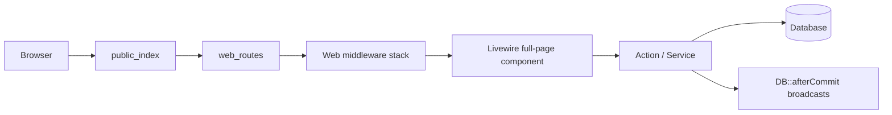

# karman.store — Project Structure

> Generated from workspace inspection (May 2026).  
> Product: **İndirimGo** — Laravel 12 e-commerce and wallet platform (storefront + operations backend).

---

## Overview

| Area | Purpose |
|------|---------|
| **Storefront** | Categories, packages, products, cart, buy-now, orders, wallet, loyalty, referrals |
| **Backend** | Fulfillments, topups, refunds, settlements, commissions, users, catalog admin |
| **Financial core** | `wallets` + `wallet_transactions` as source of truth; `system_events` for audit |
| **Realtime** | Laravel Reverb + Echo; Firebase FCM for push |

**Locales:** English (`en`) and Arabic (`ar`) — RTL-aware UI.

---

## Laravel 12 Application Skeleton

This project uses Laravel 11+ streamlined layout (no `app/Http/Kernel.php`, no `app/Console/Kernel.php`).

| Path | Role |
|------|------|
| `bootstrap/app.php` | Application factory: routes, middleware aliases, exceptions |
| `bootstrap/providers.php` | Service providers (`AppServiceProvider`, `FortifyServiceProvider`, optional Telescope) |
| `routes/web.php` | Primary HTTP + Livewire full-page routes |
| `routes/settings.php` | Fortify-adjacent user settings (profile, password, 2FA, appearance) |
| `routes/channels.php` | Private broadcast channel auth |
| `routes/console.php` | Artisan schedule / closure commands |
| `public/index.php` | Front controller |

**Registered middleware** (`bootstrap/app.php`):

- Web stack append: `SetLocale`, `CaptureReferralFromQuery`, `EnsureAccountCanUseSession`
- Aliases: `admin`, `backend`, Spatie `role`, `permission`, `role_or_permission`

**Providers** (`bootstrap/providers.php`): app bindings, Fortify views/responses, Telescope when installed.

---

## Code Organization Conventions

### Actions (application layer)

Domain mutations live in `app/Actions/{Domain}/{Verb}{Noun}.php` as invokable or `handle()` classes — not fat controllers.

```text
CheckoutFromPayload      → cart → order
PayOrderWithWallet       → wallet debit + fulfillments
ApproveTopupRequest      → credit wallet + system event
CompleteFulfillment      → status transition + notifications
```

Controllers stay thin (file downloads, JSON quotes, push token registration). Prefer Actions + Services for business rules.

### Domain vs services

| Layer | Location | Example |
|-------|----------|---------|
| Pure pricing rules | `app/Domain/Pricing/` | `PricingEngine`, `CustomAmountValidator` |
| Orchestration / IO | `app/Services/` | `PriceCalculator`, `FirebasePushService`, `SystemEventService` |
| Persistence | `app/Models/` | Eloquent + relationships, casts in `casts()` where used |

### Livewire 4 full-page components

Pages are **single-file components** under `resources/views/pages/**/⚡*.blade.php`:

- PHP class + Blade markup in one file (anonymous `extends Component`)
- Registered as `Route::livewire('/path', 'pages::frontend.main')` (namespace → folder path)
- `#[Layout('layouts::frontend')]` or backend layout attribute on the class
- Reusable widgets remain class-based under `app/Livewire/` (sidebar badges, settings, PowerGrid tables)

### Authorization

- **Route level:** `middleware('can:…')`, `backend`, `admin`
- **Action level:** policies (`app/Policies/`) and `$this->authorize()` in Livewire
- **Permission source:** `config/permission.php` → `backend_permissions` + Spatie roles (`Docs/roles.md`)

---

## Request Flow (typical Livewire page)



1. `routes/web.php` resolves a `Route::livewire()` target.
2. Middleware enforces auth, verification, backend access, or gates.
3. Component methods validate input and call Actions.
4. Financial writes run in transactions; events/notifications fire after commit.

---

## Route Map

### Public storefront

| Path | Livewire / handler | Route name |
|------|-------------------|------------|
| `/` | `pages::frontend.main` | `home` |
| `/categories/{category:slug}` | `pages::frontend.category-show` | `categories.show` |
| `/contact` | `pages::frontend.contact` | `contact` |
| `/cart` | `pages::frontend.cart` | `cart` |
| `/api/storefront/packages/search` | `SearchPackagesController` | `api.storefront.packages.search` |
| `language/{locale}` | Closure (`en` / `ar`) | `language.switch` |

### Authenticated customer (`auth`, `verified`)

| Path | Component | Route name |
|------|-----------|------------|
| `/profile` | `pages::frontend.profile` | `profile` |
| `/profile/edit` | `pages::frontend.profile-edit` | `profile.edit-information` |
| `/wallet` | `pages::frontend.wallet` | `wallet` |
| `/loyalty` | `pages::frontend.loyalty` | `loyalty` |
| `/referral-link` | `pages::frontend.referral-link` | `referral-link` |
| `/orders` | `pages::frontend.orders` | `orders.index` |
| `/orders/{order:order_number}` | `pages::frontend.order-details` | `orders.show` |
| `/notifications` | `pages::frontend.notifications` | `notifications.index` |
| `/topup-proofs/{proof}` | `TopupProofController@show` | `topup-proofs.show` |
| `/bug-attachments/{attachment}` | `BugAttachmentController@show` | `bug-attachments.show` |
| `POST /api/pricing/buy-now-custom-amount-quote` | `BuyNowCustomAmountQuoteController` | `api.pricing.buy-now-custom-amount-quote` |

### Settings (`routes/settings.php`)

| Path | Class | Route name |
|------|-------|------------|
| `/settings/profile` | `Settings\Profile` | `profile.edit` |
| `/settings/password` | `Settings\Password` | `user-password.edit` |
| `/settings/appearance` | `Settings\Appearance` | `appearance.edit` |
| `/settings/two-factor` | `Settings\TwoFactor` | `two-factor.show` |

### Backend (`auth`, `verified`, `backend`)

| Path | Component / class | Notes |
|------|-------------------|--------|
| `/dashboard` | `pages::backend.dashboard` | `can:view_dashboard` |
| `/salesperson-dashboard` | `pages::backend.salesperson-dashboard` | `can:view_referrals` |
| `/salesperson/users` | `pages::backend.salesperson-users.index` | referred users |
| `/categories`, `/packages`, `/products` | backend index pages | catalog admin |
| `/product-entry-prices` | entry prices | `can:update_product_prices` |
| `/pricing-rules`, `/loyalty-tiers` | config pages | |
| `/admin/orders`, `/admin/orders/{order}` | orders admin | |
| `/fulfillments`, `/refunds`, `/topups` | operations | |
| `/customer-funds`, `/settlements` | finance | |
| `/admin/commissions` | `CommissionsTable` | `can:manage_settlements` |
| `/admin/payout-requests` | `PayoutRequestsTable` | `can:manage_settlements` |
| `/admin/users`, `/admin/users/{user}`, `/admin/users/{user}/audit` | users | `can:manage_users` |
| `/admin/activities`, `/admin/system-events`, `/admin/notifications` | observability | |
| `POST api/admin/push/register-token` | `PushTokenController` | FCM registration |

### Admin-only

| Path | Component | Gate |
|------|-----------|------|
| `/admin/website-settings` | `pages::backend.website-settings.index` | `admin` middleware |
| `/admin/bugs`, `/admin/bugs/{bug}` | bug Livewire pages | `can:manage_bugs` |

Fortify handles login, register, password reset, and email verification (configured in `config/fortify.php` + `FortifyServiceProvider`).

---

## Database Seeders

| Seeder | Purpose |
|--------|---------|
| `RolesAndPermissionsSeeder` | Roles, permissions, backend permission grants |
| `CategorySeeder`, `PackageSeeder`, `ProductSeeder` | Catalog baseline |
| `PackageRequirementSeeder` | Requirement fields per package |
| `DefaultPricingRuleSeeder` | Default pricing rules |
| `LoyaltyTierConfigSeeder` | Loyalty tier configuration |
| `DatabaseSeeder` | Orchestrates the above |

Run: `php artisan db:seed`.

---

## Artisan Commands (`app/Console/Commands/`)

| Command | Purpose |
|---------|---------|
| `ProcessFulfillments` | Process pending fulfillment queue/workflow |
| `WalletReconcile` | Reconcile wallet balances vs transactions |
| `ProfitSettleCommand` | Settlement / profit batch processing |
| `EvaluateLoyaltyCommand` | Loyalty tier evaluation |
| `PushHealthCheckCommand` / `PushCleanupCommand` | FCM push maintenance |

Scheduled tasks (if any) live in `routes/console.php`.

---

## Top-Level Layout

```
karman.store/
├── app/                 # Application code (Actions, Models, Livewire, Services, …)
├── bootstrap/           # Laravel 12 app bootstrap (middleware, routing)
├── config/              # App, auth, permissions, PWA, Reverb, loyalty, referral, …
├── database/
│   ├── factories/
│   ├── migrations/      # ~100 migration files
│   └── seeders/
├── Docs/                # Internal documentation (this file, DB, roles, playbooks)
├── lang/                # en/ar translations + vendor backup strings
├── public/              # Web root, PWA manifest, payment-method images, assets
├── resources/
│   ├── css/             # Tailwind v4 entry
│   ├── js/              # Vite bundle (Alpine, Echo, Firebase)
│   └── views/           # Blade, Flux, Livewire full-page components
├── routes/              # web.php, settings.php, channels.php, console.php, ai.php
├── storage/             # Logs, framework cache, Livewire temp uploads
├── tests/               # Pest feature + unit tests (~120 files)
├── .cursor/             # Agent rules and project skills
├── vendor/              # Composer dependencies
└── node_modules/        # Frontend dependencies
```

---

## Tech Stack

| Layer | Packages |
|-------|----------|
| Runtime | PHP 8.4, Laravel 12 |
| UI | Livewire 4, Flux (free), Tailwind CSS 4, Alpine.js |
| Auth | Laravel Fortify (2FA, registration, password reset) |
| Permissions | `spatie/laravel-permission` |
| Audit | `spatie/laravel-activitylog` |
| Tables (admin) | `power-components/livewire-powergrid` |
| Realtime | `laravel/reverb`, `laravel-echo`, `pusher-js` |
| Push | Firebase (client + `FirebasePushService`) |
| PWA | `erag/laravel-pwa` |
| Testing | Pest 3, PHPUnit 11 |
| Dev | Laravel Telescope, Debugbar, Pint, Boost MCP |

---

## `app/` — Backend Architecture

Business logic favors **single-purpose Action classes**; UI state lives in **Livewire** (full-page components in `resources/views/pages` use the `⚡` naming convention).

```
app/
├── Actions/           # Domain commands (88+ classes, grouped by area)
├── Concerns/          # Shared traits (roles, password rules, …)
├── Console/Commands/  # e.g. WalletReconcile, ProcessFulfillments
├── Domain/Pricing/    # PricingEngine, custom-amount validation
├── DTOs/              # Data transfer objects (e.g. timeline entries)
├── Enums/             # Order, fulfillment, wallet, commission, loyalty statuses
├── Events/            # Broadcast-friendly domain events
├── Exports/           # Excel exports (e.g. users)
├── Fulfillments/      # Analytics providers for fulfillment metrics
├── Http/
│   ├── Controllers/   # Thin HTTP: proofs, bugs, API quotes, push tokens
│   └── Middleware/    # Locale, referral capture, backend/admin gates
├── Jobs/              # Queued work (e.g. SendPushNotificationJob)
├── Livewire/          # Reusable widgets (sidebar badges, settings, admin tables)
├── Models/            # Eloquent models (~35 entities)
├── Notifications/     # Laravel notifications (orders, topups, commissions, …)
├── Policies/          # Authorization (orders, fulfillments, users, …)
├── Providers/         # App, Fortify, Telescope service providers
├── Services/          # Cross-cutting services (pricing, loyalty, push, settlements)
├── Support/           # Helpers (money formatting, locales, registration source)
└── View/Components/   # Blade view components (e.g. Timeline)
```

### Actions (by domain)

| Folder | Responsibility |
|--------|----------------|
| `Actions/Orders/` | Checkout, wallet payment, refunds, admin order queries |
| `Actions/Fulfillments/` | Create, claim, start, complete, fail, retry fulfillments |
| `Actions/Topups/` | Create/approve/reject topup requests |
| `Actions/Refunds/` | Approve/reject refund requests |
| `Actions/Commissions/` | Payout batches, salesperson payout requests |
| `Actions/Products/`, `Packages/`, `Categories/` | Catalog CRUD and toggles |
| `Actions/PricingRules/`, `Pricing/` | Rules and buy-now custom amount quotes |
| `Actions/Users/` | CRUD, block/unblock, referred users |
| `Actions/UserProductPrices/` | Per-user price overrides |
| `Actions/PaymentMethods/` | Website payment method configuration |
| `Actions/Fortify/`, `Actions/Auth/` | Registration, login responses, locale sync |
| `Actions/Cart/` | Cart repricing for custom amounts |
| `Actions/Catalog/` | Storefront search |
| `Actions/Loyalty/` | Tier evaluation |

### Models (core entities)

| Model | Role |
|-------|------|
| `User` | Customers, staff, salespeople; roles, referral, locale, loyalty |
| `Category`, `Package`, `Product` | Catalog hierarchy |
| `PackageRequirement` | Dynamic fields required at checkout |
| `Order`, `OrderItem` | Purchases; custom amount via `requested_amount` |
| `Wallet`, `WalletTransaction` | **Financial source of truth** |
| `TopupRequest`, `TopupProof` | Wallet funding with optional proof upload |
| `Fulfillment`, `FulfillmentLog` | Post-payment delivery workflow |
| `SystemEvent` | Audited system/financial events |
| `Commission`, `PayoutRequest`, `PayoutBatch` | Referral commissions and payouts |
| `Settlement` | Profit/settlement accounting |
| `PricingRule`, `UserProductPrice` | Default and per-user pricing |
| `WebsiteSetting`, `PaymentMethod` | Site config and payment display |
| `LoyaltySetting`, `LoyaltyTierConfig` | Loyalty program |
| `Bug`, `BugAttachment`, `BugLink` | Internal bug reporting |
| `AdminDevice`, `PushLog` | Admin push registration and logs |

### Services

| Service | Role |
|---------|------|
| `PriceCalculator` | Server-side price computation |
| `CustomerPriceService` | Per-user price resolution |
| `SystemEventService` | Financial/system event recording |
| `SettlementProfitCalculator` | Settlement profit math |
| `LoyaltySpendService` | Loyalty spend tracking |
| `SalespersonDashboardService` | Referral dashboard metrics |
| `OperationalIntelligenceService` | Ops analytics |
| `FirebasePushService`, `PushRateLimiter` | FCM delivery |
| `NotificationRecipientService` | Who receives which notifications |
| `UserAuditTimelineService` | User audit timeline |
| `BugLinkDetectionService` | Bug URL detection |

### Enums

`OrderStatus`, `OrderItemStatus`, `FulfillmentStatus`, `FulfillmentLogLevel`, `TopupRequestStatus`, `TopupMethod`, `WalletType`, `WalletTransactionType`, `WalletTransactionDirection`, `CommissionStatus`, `PayoutRequestStatus`, `ProductAmountMode`, `LoyaltyTier`, `SystemEventSeverity`, `Timezone`

---

## Routing & Access Control

**Entry:** `routes/web.php` (loaded from `bootstrap/app.php`).

| Middleware group | Routes |
|------------------|--------|
| Public | Home, categories, contact, cart, storefront API search |
| `auth`, `verified` | Profile, wallet, orders, loyalty, referrals, notifications |
| `auth`, `verified`, `backend` | Dashboard, catalog admin, fulfillments, topups, refunds, settlements, users |
| `backend` + `can:manage_bugs` | Bug admin |
| `backend` + `admin` | Website settings (payment methods, rates) |

**Aliases:** `admin`, `backend`, Spatie `role` / `permission` / `role_or_permission`.

**Global web middleware:** `SetLocale`, `CaptureReferralFromQuery`, `EnsureAccountCanUseSession`.

Backend permissions are defined in `config/permission.php` under `backend_permissions` (e.g. `view_dashboard`, `manage_fulfillments`, `manage_settlements`, `view_referrals`).

**Roles** (see `Docs/roles.md`): `admin`, `supervisor`, `salesperson`, `customer`.

---

## `resources/views/` — Frontend Structure

```
resources/views/
├── pages/
│   ├── frontend/          # ⚡ Livewire full-page: main, cart, wallet, orders, …
│   └── backend/           # ⚡ Admin pages: dashboard, catalog, ops, settings
├── components/            # Blade components (wallet, dashboard KPIs, …)
├── layouts/               # app, auth, frontend (header/footer)
├── livewire/              # Partial Livewire views (auth, settings, sidebar, admin tables)
├── flux/                  # Flux UI primitives and icons
├── errors/                # 404 and error pages
├── emails/                # Mail templates
└── vendor/                # PowerGrid and package overrides
```

**Livewire 4 convention:** Page components live in `resources/views/pages/**/⚡*.blade.php` and are registered via `Route::livewire()` (e.g. `pages::frontend.wallet`).

**Performance conventions** (from `.cursor/rules`): prefer `wire:model.defer`/`lazy`, Alpine for UI-only state, avoid chatty `wire:model.live` on hot paths.

---

## `routes/`

| File | Purpose |
|------|---------|
| `web.php` | All primary HTTP + Livewire routes |
| `settings.php` | User settings (profile, password, 2FA, appearance) |
| `channels.php` | Broadcast channel authorization |
| `console.php` | Scheduled Artisan commands |
| `ai.php` | AI/MCP-related routes (if enabled) |

---

## `config/` — Notable Files

| File | Topic |
|------|-------|
| `permission.php` | Spatie roles + `backend_permissions` list |
| `fortify.php` | Auth features |
| `referral.php`, `loyalty.php`, `billing.php` | Business rules |
| `pwa.php` | Progressive Web App |
| `reverb.php`, `broadcasting.php` | Realtime |
| `firebase.php`, `notifications.php` | Push and notification routing |
| `filesystems.php`, `livewire.php` | Upload disks (payment methods, Livewire temp) |
| `operational_intelligence.php` | Ops metrics config |
| `telescope.php`, `boost.php` | Dev tooling |

---

## `database/`

- **~100 migrations** covering users, permissions, catalog, orders, wallets, fulfillments, topups, settlements, commissions, bugs, push logs, telescope, etc.
- **Factories** for test data generation.
- **Seeders** for roles/permissions and baseline data.

See also: `Docs/DB.md`, `Docs/system_events_map.md`.

---

## `tests/`

Pest-based suite under `tests/Feature` and `tests/Unit` (~120 files).

| Coverage areas (examples) |
|---------------------------|
| Auth, registration, 2FA, blocked sessions |
| Cart, checkout, buy-now, custom amount pricing |
| Wallet, topups, proofs, transactions |
| Orders, fulfillments, refunds |
| Referrals, commissions, payouts, settlements |
| Admin pages, permissions, notifications, PWA |
| Catalog (categories, packages, products, pricing rules) |

Run: `php artisan test --compact` or filter: `php artisan test --compact --filter=WalletTopupRequestTest`.

---

## `lang/`

| Path | Content |
|------|---------|
| `lang/en/`, `lang/ar/` | `main.php`, `messages.php`, `notifications.php`, auth, validation |
| `lang/vendor/backup/` | Spatie backup notification strings |

---

## `public/` & Assets

- **`public/manifest.json`** — PWA manifest (with `config/pwa.php`).
- **`public/images/payment-methods/`** — Uploaded payment method icons.
- **Vite** builds from `resources/css` + `resources/js/app.js` (Alpine mask, ApexCharts, Firebase, Echo).

Dev: `composer run dev` (serve + queue + Vite) or `npm run dev` / `npm run build`.

---

## `Docs/` — Existing Documentation

| File | Topic |
|------|-------|
| `PROJECT_STRUCTURE.md` | This document |
| `DB.md` | Database notes |
| `roles.md` | Role hierarchy |
| `system_events_map.md` | System events reference |
| `doc.md` | Feature/backlog notes |
| `ManualTestingPlaybook.md` | Manual QA flows |

Root: `README.md` (quick start), `NOTIFICATIONS.md`, `CLAUDE.md` / `.cursor/rules` (agent guidelines).

---

## Financial & Domain Guardrails

From project rules (`CLAUDE.md`, workspace rules):

1. **`wallet_transactions` + `wallets.balance`** are the only financial source of truth — not `system_events` alone.
2. Balance mutations must be **transactional**, **idempotent**, and mirrored by financial `system_events`.
3. Side effects and broadcasts use **`DB::afterCommit()`**.
4. **Never trust client cart totals** — recompute server-side (`PriceCalculator`, `PricingEngine`).
5. **Custom amount** lines use `requested_amount` with quantity treated as 1.
6. Preserve referral/commission contracts on payment and refund flows.

---

## Key User Flows (file pointers)

| Flow | Primary code |
|------|----------------|
| Browse & search | `pages/frontend/⚡main`, `SearchStorefrontCatalog`, API search controller |
| Cart & checkout | `⚡cart`, `CheckoutFromPayload`, `CreateOrderFromCartPayload` |
| Pay with wallet | `PayOrderWithWallet` |
| Topup wallet | `⚡wallet`, `CreateTopupRequestAction`, `TopupProofController` |
| Fulfillment ops | `pages/backend/fulfillments`, `Actions/Fulfillments/*` |
| Refunds | `pages/backend/refunds`, `ApproveRefundRequest` / `RejectRefundRequest` |
| Salesperson referrals | `⚡referral-link`, `salesperson-dashboard`, commission actions |
| Payment methods (admin) | `website-settings`, `UpsertPaymentMethod` |

---

## Tooling & Agent Support

| Path | Purpose |
|------|---------|
| `.cursor/rules/` | Laravel Boost, performance, Laravel backend conventions |
| `.cursor/skills/` | build-feature-slice, debug-laravel, livewire-refactor, ui-flux-polish |
| Laravel Boost MCP | Artisan, tinker, schema, docs search, browser logs |

---

## Workspace Notes (current branch)

Untracked/in-progress areas visible in git status include payment method uploads, Livewire temp storage config, wallet/payment-method UI, and related language strings. Treat `storage/debugbar/` and compiled views as local/runtime artifacts — not part of the canonical structure.

---

*For setup and commands, see `README.md`. For permissions and roles detail, see `Docs/roles.md`.*
